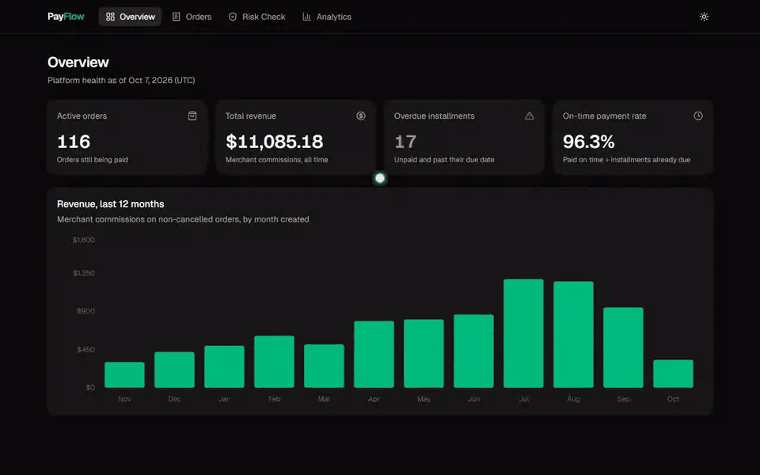
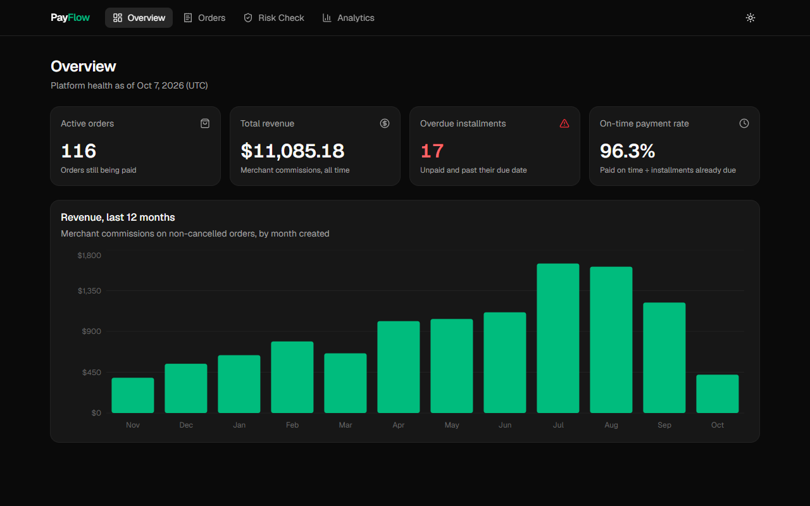
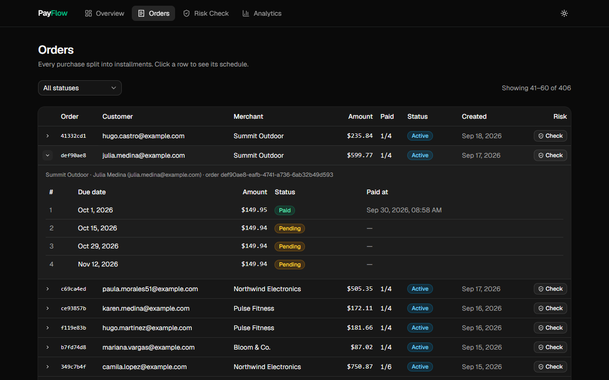
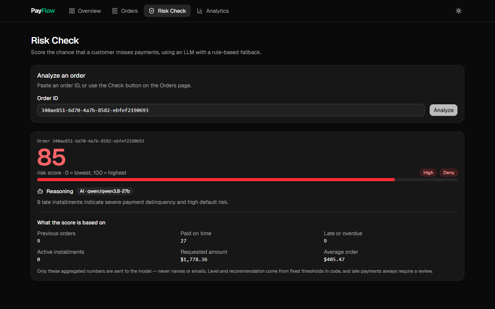
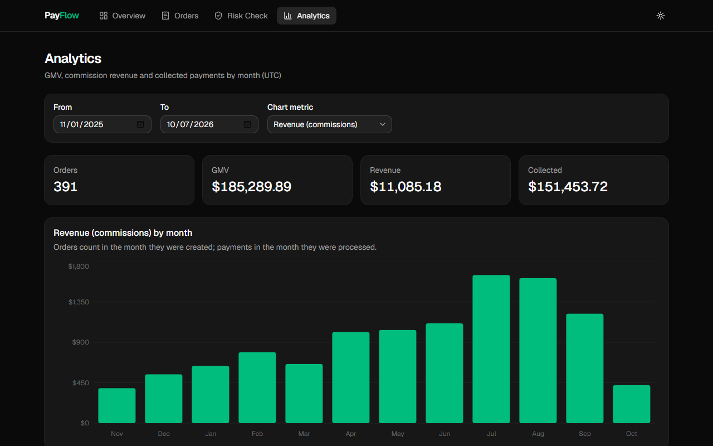
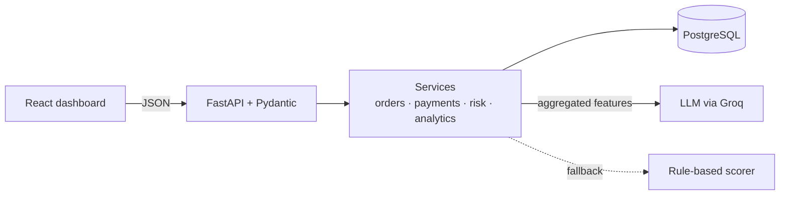

# PayFlow — Installment Payments API

Buy now, pay later, done right: split purchases into interest-free installments, collect them safely, and score credit risk with an LLM behind guardrails, all with a dashboard to watch it work.



PayFlow is a complete, tested reference implementation of an installment-payments backend. It's meant as a starting point or a worked example for any business that sells in installments (retail, marketplaces, travel, education, healthcare, fintech), with the hard parts solved: exact money, concurrent payments, payment lifecycle and AI you can audit.

## Highlights

- **Exact money:** `NUMERIC` in Postgres, `Decimal` in Python and strings in JSON. Installments always add up to the order total, and fees are rounded per order, so every report agrees to the cent.
- **No double charges:** every payment locks its order row. Measured against the running API, removing the lock let concurrent requests create 26 payments for 6 installments; with it, exactly 6.
- **Clear lifecycle:** installments go `pending → paid` or `pending → overdue → paid`. Orders complete themselves, and customers with overdue debt can't buy again. The daily overdue job is idempotent.
- **AI you can audit:** the LLM only sees aggregated, non-personal numbers. Its JSON is validated against a schema, thresholds and hard rules live in code, and a deterministic scorer takes over if the model is down.
- **Tested:** 204 tests against a real Postgres database, with 100% backend coverage. Six deliberately injected bugs were all caught, and ruff and mypy are clean.

## Quick start

Requirements: Docker and Node.js 20.19+. A free [Groq API key](https://console.groq.com/keys) is optional: without one, risk scoring uses the rule-based fallback.

```bash
cp .env.example .env                                  # optionally add GROQ_API_KEY
docker compose up -d                                  # Postgres + API: http://localhost:8000/docs
docker compose exec app python -m scripts.seed_demo   # ~11 months of realistic demo data
cd frontend && npm install && npm run dev             # dashboard: http://localhost:5173
```

| Overview | Orders |
| --- | --- |
|  |  |
| **Risk check** | **Analytics** |
|  |  |

## Adapt it to your business

| To change | Edit |
| --- | --- |
| Allowed number of installments (1–12, default 4) | `OrderCreateRequest` in `app/db/schemas.py` |
| Time between installments (14 days) | `INSTALLMENT_INTERVAL` in `app/services/order_service.py` |
| Fee charged to each merchant | `commission_rate` when creating the merchant |
| What counts as overdue | `app/services/installment_rules.py` (shared by orders, risk and analytics) |
| Risk thresholds and hard rules | `risk_level_for` and `LATE_PAYMENT_SCORE_FLOOR` in `app/services/ai_service.py` |
| LLM model or prompt | `GROQ_MODEL` in `.env`, `RISK_PROMPT` in `app/services/ai_service.py` |
| Currency shown in the dashboard | `frontend/src/lib/format.ts` |
| Dashboard origins allowed by the API | `CORS_ORIGINS=https://app.example.com` in `.env` (comma-separated) |

## How it works



- **Orders:** the total is split by rounding down to the cent, and the leftover cents go to the first installment ($100 in 3 → 33.34 + 33.33 + 33.33). The order and its schedule are written in one transaction.
- **Payments:** only the exact amount is accepted, and paying twice returns `409`. The order lock also orders cancellations, so they can't deadlock with payments.
- **Risk:**
  1. Six features are aggregated with SQL, and the database transaction ends before the LLM call.
  2. The model answers in JSON (`temperature=0.1`, 8 s timeout).
  3. Pydantic validates the answer.
  4. Code turns the score into approve, review or deny, and late payers never get an automatic approval.
- **Architecture:** business rules live in services that know nothing about HTTP. Domain errors map to `404`, `409` and `422` in a single place, every response carries security headers (`Cache-Control: no-store`, `Referrer-Policy`, `nosniff`, HSTS), and every schema change is an Alembic migration.

| Area | Endpoints (under `/api/v1`) |
| --- | --- |
| Customers and merchants | `POST /users/` · `GET /users/{id}` · `GET /users/{id}/orders` · `POST /merchants/` · `GET /merchants/{id}` |
| Orders | `POST /orders/` · `GET /orders/` (paginated) · `GET /orders/{id}` · `PATCH /orders/{id}/cancel` |
| Payments | `POST /payments/` · `POST /installments/check-overdue` (daily job) |
| Risk and analytics | `POST /orders/{id}/risk` · `GET /analytics/summary` · `GET /analytics/revenue?start=&end=` |

## Tests and quality

```bash
docker compose exec app pytest --cov            # 204 tests, 100% coverage of app/
docker compose exec app ruff check .            # lint
docker compose exec app mypy app scripts        # types
```

- **A real database:** each run recreates a separate database from the Alembic migrations, so the demo data is never touched.
- **The LLM is mocked:** valid, contradictory, malformed and timed-out answers are all covered.
- **Concurrency is exercised:** simultaneous payments charge an installment exactly once.
- **The seed doubles as a long integration test:** months of simulated activity must leave the data consistent.
- **Mutation-checked:** the suite fails when the order lock, the rounding rule, the overdue rule, the AI guardrail, the prompt's privacy or the CORS policy is broken.

## Stack

Python 3.12 · FastAPI · SQLAlchemy 2.0 (async) · PostgreSQL 16 · Alembic · Groq (`qwen/qwen3.8-27b`, configurable) · React 19 · TypeScript · Vite · Tailwind CSS · shadcn/ui · Recharts · TanStack Query · Docker Compose · pytest

## Roadmap

Authentication · idempotency keys for payments · CI pipeline · audit log of risk assessments · partial payments, refunds and late fees.
